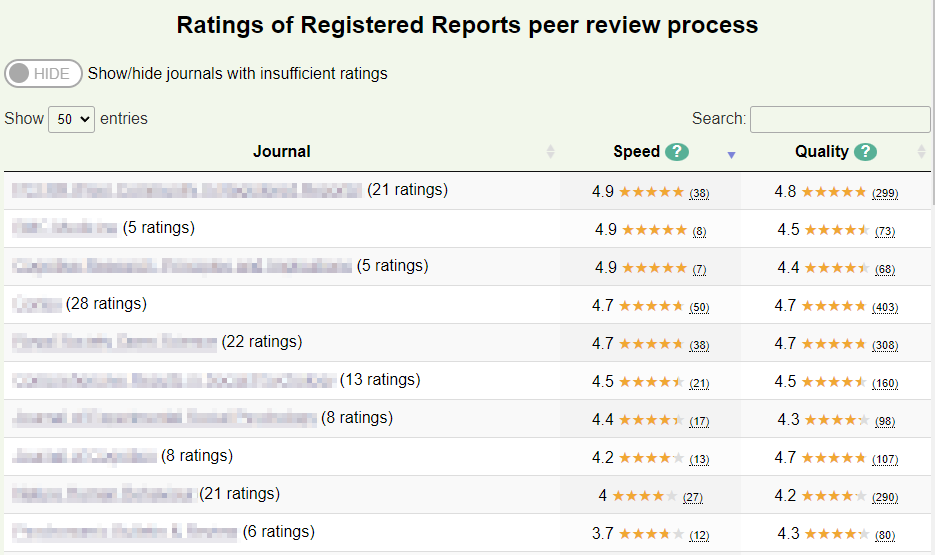

# Registered Reports Community Feedback
## Overview
This is the source code for a PhD project gathering data about [Registered Reports](https://cos.io/rr) peer review. It allows registered users to give feedback about the speed and quality of the Registered Reports peer review process they experienced as authors or reviewers. Using this feedback, summary data is presented in dashboards, showing both how journals rank on speed/quality, and per-journal details.

The project is currently live at: [https://registeredreports.cardiff.ac.uk](https://registeredreports.cardiff.ac.uk)

We share this code in case individuals or organisations wish to use and/or extend it for their own purposes. We will also accept pull requests for additional features/bug requests etc - please feel free to open an issue!

## How to install your own instance
This requires PHP and a MySQL (or MariaDB) installation. It also relies on [Composer](https://getcomposer.org) to manage the additional packages PHP uses (see `composer.json` in root directory) - please ensure all three are installed prior to continuing.

### Steps
1. Copy all files to your folder of choice (e.g. localhost/feedback).
2. Import `assets/setup/DBcreation.sql` into your database instance.
3. Edit `assets/setup/env.php` to include relevant information i.e. database, mail server, and Composer path ($vendor_path pointing to your Composer's `autoload.php` location).
4. Place `composer.json` in the correct directory for your Composer install.
5. You should now have a working instance!

## Tips
1. As new journals offer the Registered Reports format, you may wish to add them to the list of journals users can give feedback on. To do so, add the journal to the `journals` table - the only fields which are required are `journal_name` and `journal_url`.
2. If you wish to export the data for analysis, please get in touch - we have an export script we can share (and will add to this repository soon).

## Video explanation of project

